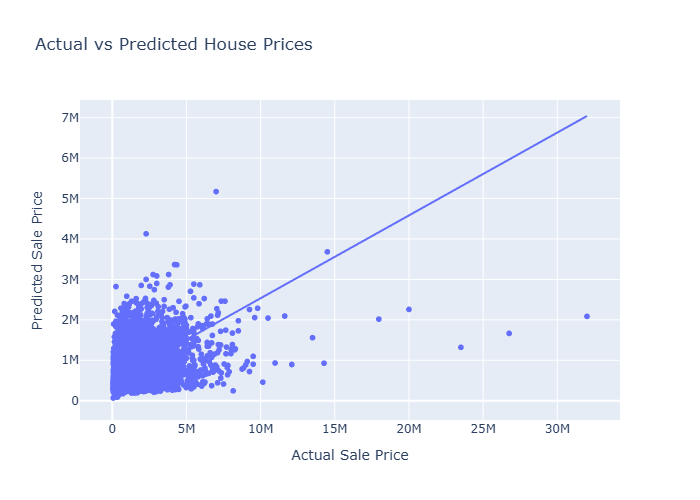

# **Assignment 2: Linear Regression, Data Cleaning, and Feature Engineering**  
**Author:** Nathaniel Davis  

## **Project Overview**  
This project applies a **Linear Regression model** to predict house sale prices using housing data from King County. The dataset includes various property attributes, and the target variable is **`sale_price`**.

# **https://youtu.be/jfNapQaJtdg**
---

## **Dataset Description**  
- **Source:** `kingco_sales.csv`  
- **Target Variable:** `sale_price`  
- **Key Features Used for Modeling:**  
  - `sqft` (Square footage of the property)  
  - `beds` (Number of bedrooms)  
  - `bath_full` (Number of full bathrooms)  
  - `bath_half` (Number of half bathrooms)  
  - `house_age` (Engineered feature: `join_year - year_built`)  

---

## **Data Cleaning & Feature Engineering**  
1. **Missing Values Handling:**  
   - Dropped columns with >50% missing values.  
   - Imputed remaining missing values using median (numeric) or mode (categorical).  

2. **Outlier Removal:**  
   - Removed outliers using IQR for key numerical features:  
     - `sale_price`: 37,742 outliers removed  
     - `sqft`: 10,490 outliers removed  

3. **Feature Engineering:**  
   - Created `house_age` = `join_year - year_built`.  
   - Summary of `house_age`: Mean = 49.29 years, Range = 0–125 years  

4. **Final Dataset Shape:**  
   - **543,281 rows × 16 columns**  

---

## **Modeling Approach**  
- **Algorithm:** Linear Regression  
- **Train/Test Split:** 80/20  
  - Training set: 473,210 rows  
  - Testing set: 118,303 rows  

---

## **Model Evaluation**  
- **R² Score:** `0.2101`  
- **Root Mean Squared Error (RMSE):** `496,496.33`  

---

## **Visualization**  
Below is a preview of the scatter plot comparing **Actual vs Predicted Sale Prices**:

---
